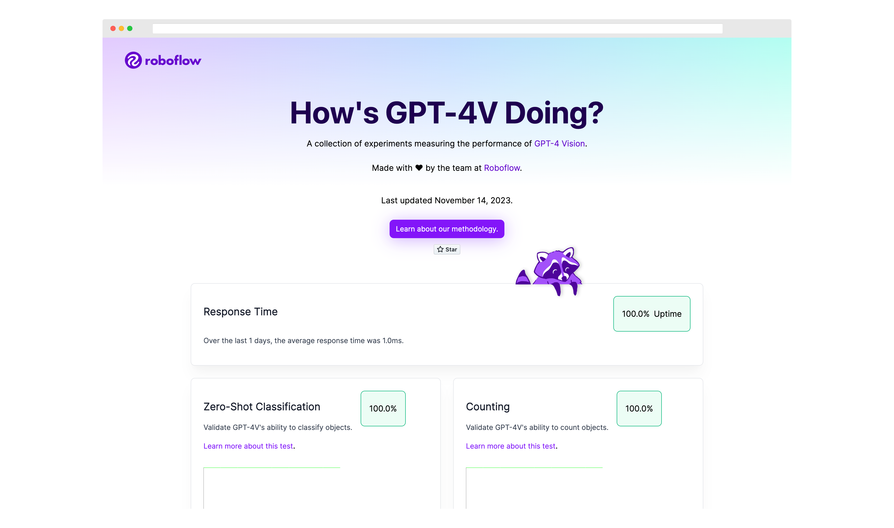

# GPT-4V Checkup

Open source monitor that tests how [GPT-4V](https://openai.com/research/gpt-4v-system-card) performs on image prompts over time.

This project is not affiliated with OpenAI.

See the companion [foundation-vision-benchmark](https://github.com/roboflow/foundation-vision-benchmark) repository for more information about qualitatively evaluating foundation vision models like we do on this website.



## ⚠️ Limitations

Given the vast array of possibilities with vision models, no set of tests, this one included, can comprehensively evaluate what a model can do; this repository is a starting point for exploration.

## 🦸 Contribute

We would love your help in making this repository even better! Whether you want to
add a new experiment or have any suggestions for improvement,
feel free to open an [issue](https://github.com/roboflow/awesome-openai-vision-api-experiments/issues)
or [pull request](https://github.com/roboflow/awesome-openai-vision-api-experiments/pulls).

We welcome additions to the list of tests. If you contribute a test, we will run it daily.

To contribute a test, first fork this repository. Then, clone your fork locally:

```bash
git clone <your fork>
cd gpt-checkup
```

Here is the structure of the project:

- `tests`: Contains the tests that are run daily.
- `images`: Contains the images used in the tests.
- `results`: Contains the results of the tests saved from each day.
- `web.py`: Contains the code used to run the tests and create the website.
- `template.html`: The template for the website. Used to generate the `index.html` file.

Then, create a new file in the `tests` directory with the name of the test you want to add. Use the `mathocr.py` file as an example.

In your test, you will need to specify:

1. A test name
2. A test ID
3. The question you are answering (for display on the website only)
4. The prompt to send to the model
5. The image to send to the model
6. A description of the method used in the test (for display on the website only)

Add the image(s) you want to use in your test(s) in the `images` directory.

Add the name of the test class you created to the `test_list` list in the `web.py` file
and to the imports in the `tests/__init__.py` file.

Before you run the tests locally, you will need to set up an OpenAI API key. Refer to the official OpenAI documentation for instructions on [how to retrieve your OpenAI API key](https://help.openai.com/en/articles/4936850-where-do-i-find-my-api-key).

Export your key into a variable called `OPENAI_API_KEY` in your environment:

```bash
export OPENAI_API_KEY=<your key>
```

Then, run the tests:

```bash
python3 web.py
```

You will see messages printed in your console as each test is run:

```text
Running Document OCR test...
Running Handwriting OCR test...
Running Structured Data OCR test...
Running Math OCR test...
Running Object Detection test...
Running Graph Understanding test...
...
```

When the script has run, the results of all tests will show up in the `index.html` file. A new file will be added to the `results` directory which contains a JSON representation of the test results.